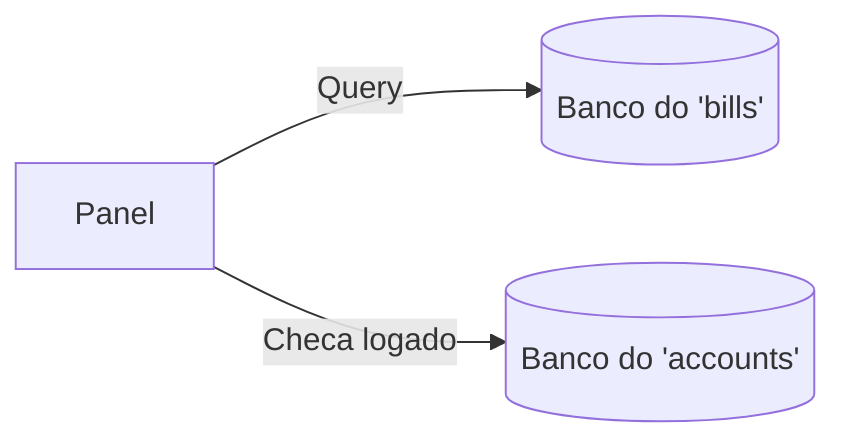

# 🖥️ Módulo `panel`

## 1. Visão Geral (Linguagem Simples)
O `panel` é o aplicativo "vitrine" do Voto Claro. Tudo o que não exige permissão e está exposto pro público em geral, fica aqui. É a tela inicial de listagem de leis traduzidas, as páginas de leitura dos resumos, a comparação com o texto original jurídico, e o botão onde o cidadão comum dedura (sinaliza) um erro na IA.
Ele não cadastra nem gera nada por conta própria, apenas "puxa" dados que foram processados pelo módulo `bills`.

## 2. Estrutura de Arquivos

| Arquivo | Papel no Voto Claro |
|---------|---------------------|
| `views.py` | Lida com os *requests* da população: listagem paginada, visualização detalhada e formulário de denúncia. |
| `urls.py` | Caminhos públicos como `/` e `/projeto/<slug>/`. |
| `search.py` | Lógica destacada de busca textual para as pesquisas do painel. |
| `forms.py` | Apenas o formulário de captura de denúncia (Flag). |

## 3. Modelos (Entidades)
Não possui modelos próprios. Consome ativamente `Bill`, `Submission`, `Theme` e `Flag` do módulo `bills`.

## 4. Rotas e Endpoints

| Rota | Handler | Nome Interno | O que faz |
|------|---------|--------------|-----------|
| `/` | `views.panel_list` | `panel_list` | Homepage. Puxa projetos, aplica filtros de busca, tema e data, e faz paginação. |
| `/projeto/<slug>/` | `views.panel_detail` | `panel_detail` | Mostra os campos gerados pela IA (como `summary`, `practical_changes`) da versão acessível do projeto. |
| `/projeto/<slug>/original/` | `views.panel_original` | `panel_original` | Uma aba separada que mostra ao leitor o texto original denso e jurídico sem filtros. |
| `/projeto/<slug>/sinalizar/` | `views.panel_sinalizar` | `panel_sinalizar` | Recebe (POST) uma denúncia do usuário, salvando como `Flag` atrelada à versão e ao `user` logado. |

## 5. Integração com outros Módulos

A view `panel_sinalizar` cria um registro de `Flag`. Caso o leitor esteja logado (no `accounts.User`), o sistema vincula o perfil à denúncia. Senão, fica anônima.

## 6. ⚠️ Dívidas Técnicas (Tech Debts & Bugs Latentes)
1. **Listagem Falha de Status:** Na `views.panel_list`, a consulta do banco puxa os projetos baseando-se em `Submission.Status.GENERATED`. Isso é um bug de regra de negócios bizarro: a interface deveria mostrar apenas os que a curadoria aprovou (Status `PUBLISHED`). Atualmente o painel público vaza projetos não revisados pelos curadores! O mesmo ocorre no `panel_detail`.
2. **Inconsistência nas Views:** As funções `panel_original` e `panel_sinalizar` utilizam o helper `get_published_bill_or_404`, checando corretamente o `current_version__published_at__isnull=False`. Ou seja: ver a capa do projeto deixa vazar texto não revisado, mas tentar clicar pra ver o texto original bloqueia e devolve 404 caso não seja publicado.
