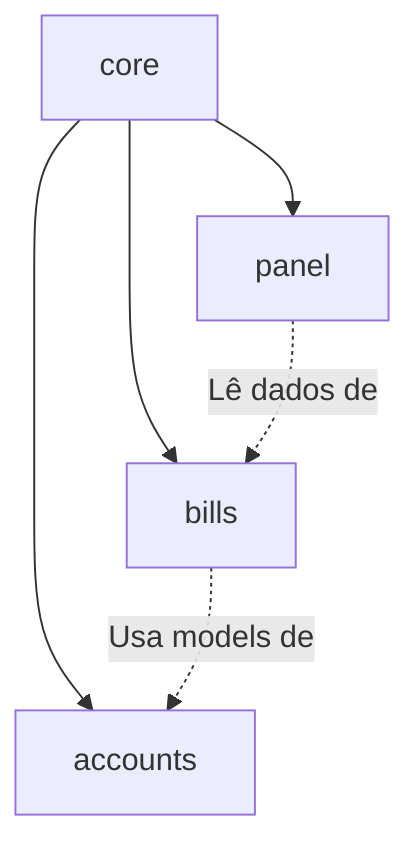
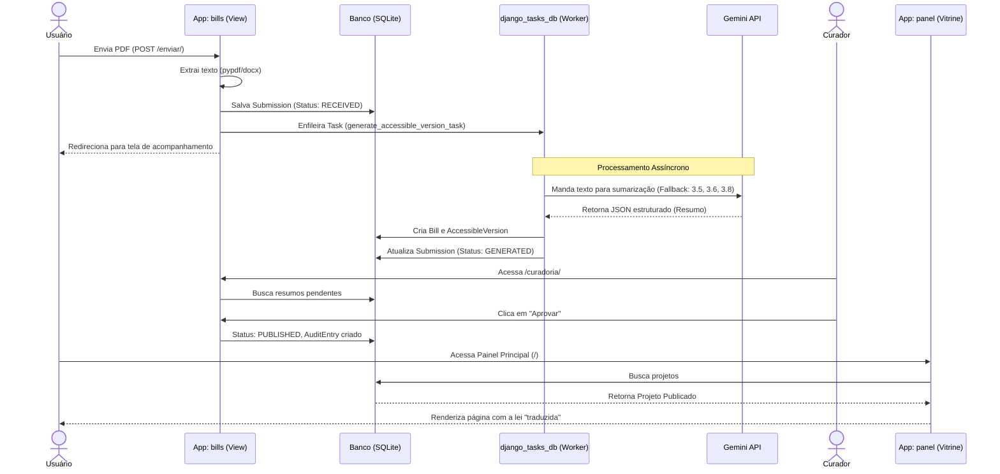

# 🏛️ Arquitetura Geral

## 1. Visão Geral (Linguagem Simples)
O **Voto Claro** funciona como uma "linha de produção" de leis traduzidas. 
1. **Entrada:** Um usuário comum se cadastra e envia um projeto de lei (via PDF, DOCX ou colando texto/link). 
2. **Triagem e Processamento (Motor):** O sistema guarda esse documento, extrai o texto bruto e manda para uma fila de espera. Nos bastidores (assincronamente), nós chamamos a Inteligência Artificial (Google Gemini) para "ler" esse calhamaço e produzir um resumo mastigado. 
3. **Controle de Qualidade (Curadoria):** O resumo da IA não vai direto para o público. Uma equipe especializada (Curadores) analisa, edita se precisar e então clica em "Aprovar".
4. **Vitrine (Painel Público):** Só depois de aprovado é que o projeto aparece no painel principal, onde qualquer cidadão pode pesquisar e entender o que a lei faz. Se o cidadão achar que o resumo da IA ficou tendencioso, ele pode "Sinalizar" um erro, e a equipe de curadoria julgará isso.

## 2. Mapa de Módulos (Dependências)

*Nota:* O módulo `panel` é fortemente dependente do banco de dados do `bills` (lê os models `Bill`, `Submission`, etc). O módulo `bills` depende de `accounts` para o model de `User`.

## 3. Fluxo Principal de Requisição (Submissão até Publicação)

## 4. Integrações Externas
A única integração externa de peso é com a API do **Google Gemini**. 
- **Onde:** `bills/adapters/gemini_adapter.py`.
- **Como:** Passamos um prompt detalhado exigindo um JSON padronizado através do Pydantic (`GenerationResult`).
- **🛡️ Sistema de Resiliência (Circuit Breaker):** Devido à instabilidade da API e deprecamento de modelos (ex: erro 404 no 2.5-flash), implementamos um **Fallback Array**. O sistema tenta se conectar aos modelos `gemini-3.5-flash`, `3.6-flash` e `3.8-flash`. Se ocorrer erro de limite (429), indisponibilidade (503) ou modelo não encontrado (404), ele pula automaticamente para o próximo. Caso esgote os modelos, faz um *Exponential Backoff* (espera 5s e tenta novamente).

## 5. Tarefas Assíncronas (Background Jobs)
Em vez do Celery, este projeto utiliza o novíssimo ecossistema do Django 6.1 com o plugin `django_tasks_db`. 
- Isso significa que as filas residem no próprio banco relacional (SQLite/Postgres).
- **Tarefa principal:** `generate_accessible_version_task` (em `bills/tasks.py`), engatilhada sempre que uma submissão passa pela validação básica.

## 6. Configuração por Ambiente
Não há dockerização ou configuração multienvironment (staging/prod) estruturada ainda. 
- O projeto usa `python-dotenv` para injetar variáveis do arquivo `.env`. 
- `SECRET_KEY` e `DEBUG` são lidos dinamicamente de `core/settings.py`.

## 7. ⚠️ Dívidas Técnicas / Pegadinhas Arquiteturais
1. **Falta de isolamento de Domínio:** A busca e listagem no `panel/views.py` injeta diretamente as lógicas dos *choices* da submissão do `bills/models.py`. Se o modelo interno de processamento do `bills` mudar, o painel de exibição quebra.
2. **Dependências Ocultas:** O `pyproject.toml` especifica `openai>=3.10.0` mas o código em `gemini_adapter.py` utiliza `google.genai`. Para rodar localmente, o desenvolvedor talvez precise fazer `uv add google-genai`.
3. **SQLite no Git:** A regra de negócio proíbe o banco de dados no git, mas o `db.sqlite3` atual tem 6MB e, apesar de estar no `.gitignore`, parece ter sido comitado no passado.

## 8. Arquitetura de Frontend
O design system não utiliza frameworks complexos ou dependências Node/NPM.
- **CSS Centralizado:** Ocorre no arquivo estático `/static/css/style.css`, lido como pasta estática global do Django configurada em `STATICFILES_DIRS`. 
- **Herança de Templates:** Todos os templates HTML das aplicações (como `accounts`, `bills`, e `panel`) estendem uma casca principal chamada `base.html` que injeta a navegação e a folha de estilos. Isso garante um layout DRY e um visual institucional rigoroso focado na legibilidade, guiado pela skill `frontend-design`.
