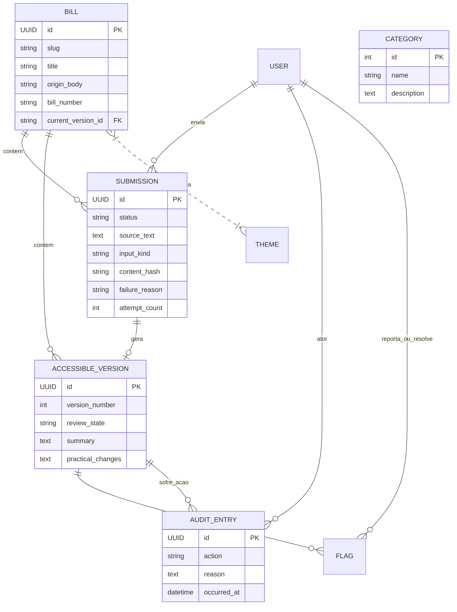

# 💾 Banco de Dados

## 1. Visão Geral (Linguagem Simples)
Imagine nosso banco de dados como um arquivo de pastas de um tribunal. 
- A ficha corrida de um cidadão é a `Submission` (o documento original que enviaram). 
- A ficha do caso em si (a "Ideia da lei") é o `Bill`. 
- Cada caso tem várias "Versões de relatório" (`AccessibleVersion`), pois a IA pode errar, e o curador pede pra ela reescrever.
- Se o público ver um erro, ele pendura um *Post-it* amarelo (`Flag`) na versão avisando do erro.
- Para evitar que o estagiário apague algo grave, temos um grande "Livro Caixa" inalterável (`AuditEntry`) que grava quem aprovou ou apagou cada versão de documento.

## 2. Diagrama de Entidade-Relacionamento (ER)

## 3. Tabela de Entidades (Dicionário de Dados)

### App: `accounts`
| Tabela | Campos | Descrição |
|--------|--------|-----------|
| `User` | `is_curator` (Boolean) + (Campos do AbstractUser) | Usuários base e controle de acesso ao painel de aprovação. |

### App: `bills`
| Tabela | Principais Campos | Índices e Chaves | Papel |
|--------|-------------------|------------------|-------|
| `Theme` | `name`, `slug` | `slug` (Unique) | Temas (Educação, Saúde). |
| `Category` | `name`, `description` | `name` (Unique) | Categorias de agrupamento genérico. |
| `Bill` | `id` (UUID), `title`, `slug`, `current_version` (FK) | `current_version` aponta para a `AccessibleVersion` atual | O conceito guarda-chuva de um Projeto de Lei. |
| `Submission` | `id`, `submitter` (FK), `source_text`, `status`, `input_kind`, `content_hash` | Protegido contra deleção do usuário | Rastreia a tentativa de upload crua e o status do processamento da IA (RECEIVED, FAILED, PUBLISHED...). |
| `AccessibleVersion` | `id`, `bill` (FK), `submission` (FK), `version_number`, `summary`, `practical_changes`, `review_state` | Index: `[review_state, generated_at]`. Unique: `[bill, version_number]` | O resumo real traduzido pelo Gemini. A tabela é versionada. |
| `Flag` | `id`, `version` (FK), `reporter` (FK), `state`, `description`, `resolution_note` | - | Denúncias (erros de tradução relatados no painel público). |
| `AuditEntry` | `id`, `bill` (FK), `version` (FK), `action`, `actor` (FK), `reason` | - | Tabela *append-only* logando as ações críticas do sistema. |

## 4. ⚠️ Dívidas Técnicas / Pegadinhas de Banco
1. **Recursão de Deleção (Cascata vs Protect):** No model `Submission`, o campo `submitter` (User) possui `on_delete=models.PROTECT`. Mas o `AccessibleVersion` usa `on_delete=models.CASCADE` no `bill`. Excluir uma "Bill" via admin apagará sumariamente os resumos da IA sem choro.
2. **Ciclo de FK:** O model `Bill` aponta para `AccessibleVersion` (`current_version_id`), e `AccessibleVersion` aponta obrigatoriamente de volta para `Bill`. Inserir dados de teste direto no banco vai exigir desabilitar checagem de integridade ou inserir como nulo antes.
3. **AuditEntry Invencível:** O `AuditEntry.save()` joga exceção se a PK já existir (`not self._state.adding`). O `.delete()` também joga uma `ValidationError`. Isso significa que nem o super admin via shell consegue deletar com facilidade, a menos que ele execute QuerySets raw de banco ignorando os hooks do Django.
4. **Campo Oculto:** O `Submission.source_text` aceita entre 500 e 50.000 caracteres, mas tem uma validação rústica que busca `[' o ', ' a ', ' os ', ' as ']` para conferir se é português. É altamente recomendável no futuro migrar isso pra uma detecção mais esperta.
